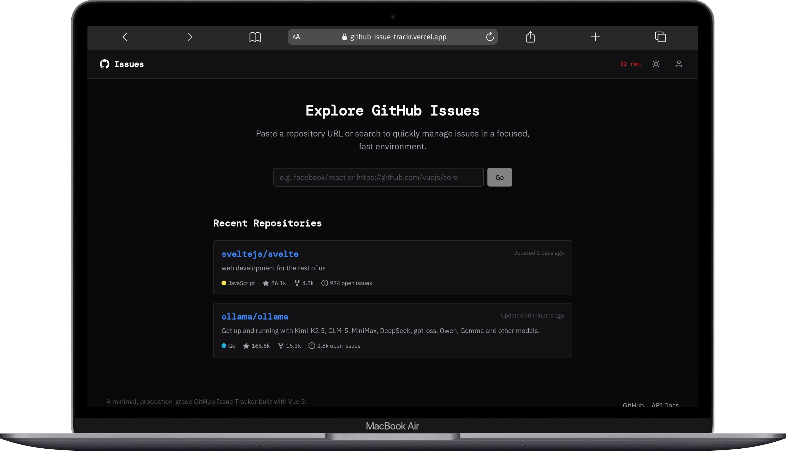

# GitHub Issue Tracker SPA

[](https://github.com/blackstart-labs/github-issue-tracker/actions/workflows/ci.yml)
[](https://github.com/blackstart-labs/github-issue-tracker/actions/workflows/deploy.yml)
[](https://opensource.org/licenses/MIT)

A production-grade, high-performance Single Page Application (SPA) for tracking GitHub issues. Built with **Vue 3**, **Vite**, and **Pinia**, featuring a signature "Editorial Utility" aesthetic—sharp, dense, and intentional.

 

## ✨ Features

- **Modern UI/UX**: "Editorial Utility" design system with vanilla CSS and custom properties.
- **Dark Mode**: Comprehensive light/dark theme support with system preference detection and instant swapping.
- **Advanced Filtering**: Filter by state (open/closed), labels, milestones, and assignees.
- **Deep Linking**: Sync navigation state, filters, and pagination with URL query parameters for shareability.
- **High Performance**:
  - Debounced repo search.
  - Intersection Observer for scroll-heavy lists.
  - Optimized markdown rendering with syntax highlighting.
- **Productivity Focused**:
  - **Command Palette (Cmd+K)** for quick navigation.
  - **Keyboard Shortcuts**: `/` to focus search, `Esc` to close modals.
- **Security & Rate Limits**:
  - Securely store Personal Access Tokens (PAT) in LocalStorage.
  - Live rate limit tracking in the header.
  - Resilience against 403/429 errors.

## 🛠 Tech Stack

- **Framework**: [Vue 3](https://vuejs.org/) (Composition API, `<script setup>`)
- **Build Tool**: [Vite 5](https://vitejs.dev/)
- **State Management**: [Pinia](https://pinia.vuejs.org/)
- **Routing**: [Vue Router 4](https://router.vuejs.org/) (Hash Mode)
- **API Client**: [Axios](https://github.com/axios/axios) with request/response interceptors
- **Composables**: [VueUse](https://vueuse.org/)
- **Styling**: Vanilla CSS (CSS Variables, Modern Reset)
- **Utilities**: `date-fns`, `marked`, `highlight.js`, `dompurify`
- **Testing**: `Vitest`, `Vue Test Utils`

## 🚀 Getting Started

### Prerequisites

- [Bun](https://bun.sh/) (Recommended) or [Node.js](https://nodejs.org/) (v20+)

### Installation

1. Clone the repository:
   ```bash
   git clone https://github.com/blackstart-labs/github-issue-tracker.git
   cd github-issue-tracker
   ```

2. Install dependencies:
   ```bash
   bun install
   ```

3. (Optional) Configure environment variables:
   Copy `.env.example` to `.env` and add your [GitHub Personal Access Token](https://github.com/settings/tokens) (classic or fine-grained) for higher rate limits.
   ```bash
   cp .env.example .env
   ```

4. Start the development server:
   ```bash
   bun dev
   ```

## 🐳 Docker Support

Build and run the application in a lightweight container:

```bash
# Build the image
docker build -t github-issue-tracker .

# Run the container
docker run -p 8080:80 github-issue-tracker
```

Alternatively, use the provided Docker Compose:

```bash
docker-compose up -d
```

The application will be accessible at `http://localhost:8080`.

## 🧪 Testing

Run unit tests with Vitest:
```bash
bun test:unit
```

## 📐 Implementation Details

### Design Tokens
Defined in `src/assets/styles/base.css`, the design system uses a strict set of HSL-based color tokens, intentional spacing, and sharp border-radii (`4px`) to achieve a high-density, professional look inspired by tools like Linear and Vercel.

### State Sync
The `IssuesView` utilizes a two-way sync between Pinia state and URL query parameters via the `useIssues` and `useRepo` composables, ensuring that the view state is always reproducible from the URL.

### Security
Markdown rendering is sanitized using `DOMPurify` after being processed by `marked` and highlighted via `highlight.js`.

## 🤝 Contributing

Contributions are welcome! Please read our [Contributing Guidelines](CONTRIBUTING.md) and [Code of Conduct](CODE_OF_CONDUCT.md).

## 📄 License

This project is licensed under the [MIT License](LICENSE).
